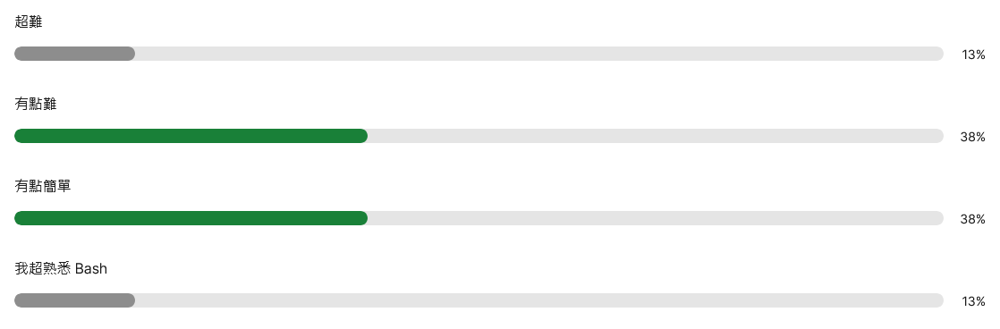
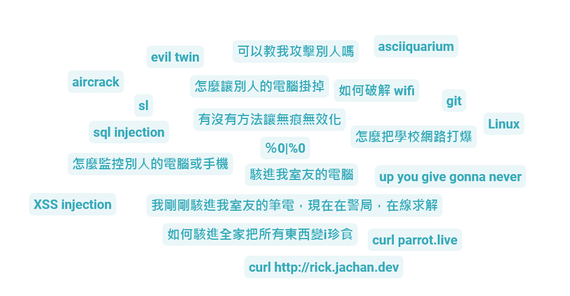
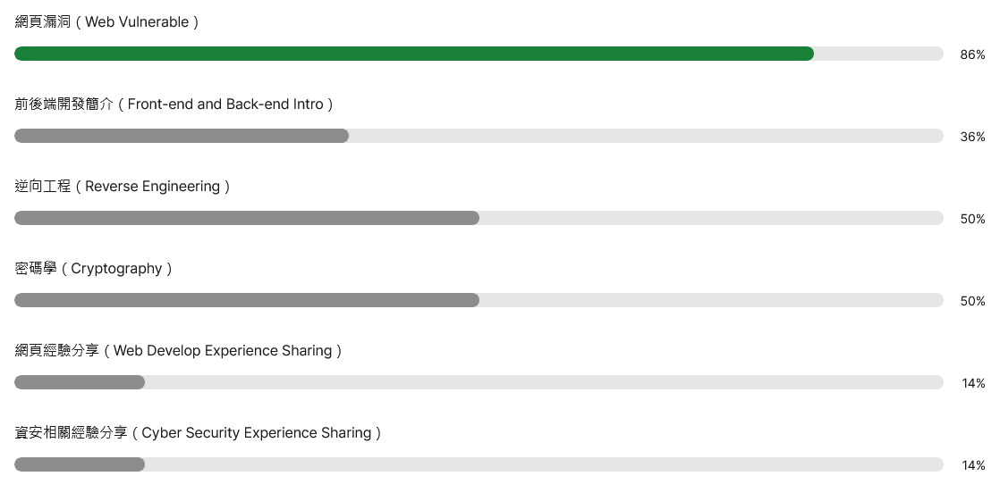

- 簡報：[https://surl.ttymayor.com/linux-slide](https://surl.ttymayor.com/linux-slide)

<iframe src="https://app.sli.do/event/565v78gUxmApPjTy4rneku" height="100%" width="100%" frameBorder="0" style="min-height: 720px;" allow="clipboard-write" title="Slido" class="rounded-lg"></iframe>
